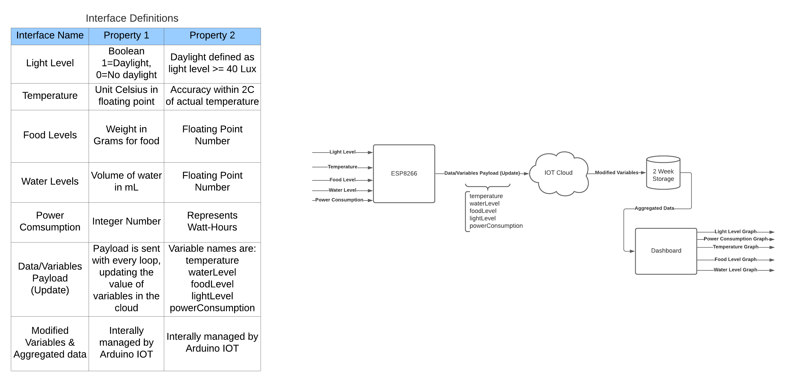
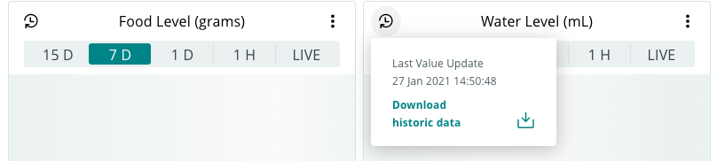
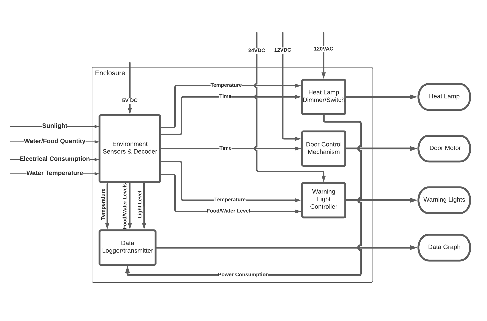

# Data Transmitter - Smart Coop

## Introduction
A key requirement of the Smart Coop implementation is the neccessity to monitor the food, water, daylight duration, and electrical consumption history for the past 2 weeks. In addition to that storage of data, this information should automatically become transmitted into a graph to allow for the stackeholder to view dynamic data regarding their Smart Coop. This repository contains the code and information surrounding the implementation of this block, with the block diagram of the high level logic displayed below.

## Intergration Summary

In order to enable 2 weeks of reliable data storage and the ability to dynamically generate a variety of graphs that can be accessed anywhere, the Arduino IOT [Arduino IOT Platform](https://www.arduino.cc/en/IoT/HomePage) was used. By leveraging this service, a WiFi enabled Arduino board is able to save data to the cloud by performing network requests over the internet. By using a cloud service such as Arduino IOT, the data that is logged by the Smart Coop is reliably stored, and can be accessed from anywhere in the world as long as there is an internet connection.

The Arduino IOT exposes a great [library](https://www.arduino.cc/reference/en/iot/api/) that allows developers to interact with the cloud service to store, manage, and manipulate data. Furthermore, it allows users to create dynamic dashboards with a variety of graphs that change as new data becomes stored. It even allows you to download the historic data into a .csv format as shown below.

## How to use this Block (expected inputs)

Currently, the main sketch (DataTransmitter.ino) is utilizing mock functions to mimic the expected inputs that are shown in the block diagram. The functions are:

- mockGetWaterLvl (float)

- mockGetFoodLvl (float)

- mockGetTemperature (float)

- mockGetPowerConsumption (float)

- mockGetLightLevel (boolean)

A block that interfaces with this block will need to replace these functions with actual getter functions that will produce return the values to be sent to the cloud. For example, in our top level diagram, the "Environment Sensors & Decoder block" will provide the getter functions for food, water, temperature, and light. The "Heat Lamp Dimmer/Switch" block will be what provides the power consumption getter function.

Currently the loop is set up such that these values become updated in the cloud every 5 seconds. 

**Mark Huynh**
