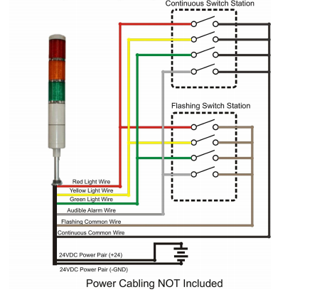
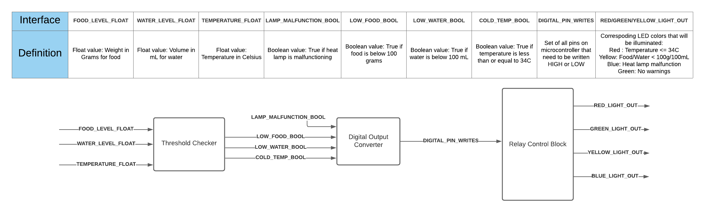
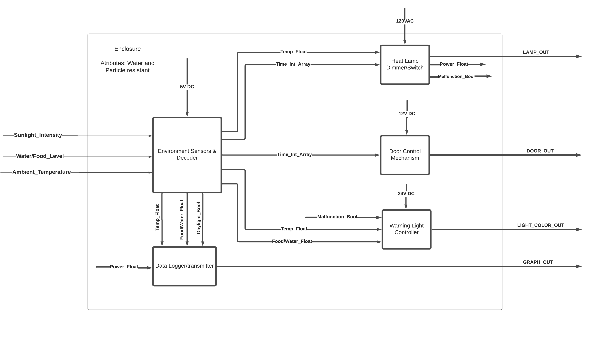

# Warning Lights - Smart Coop

## Introduction
A key requirement of the Smart Coop implementation is the neccessity to turning on the necessary lights in a Patlite Signal Tower according to specific categories of warnings. This wiring of the tower is depicted below.

For the requirements of this project. The warnings necessary and their corresponding lights consist of:

- Red : Temperature <= 34C
- Yellow: Food/Water < 100g/100mL
- Blue: Heat lamp malfunction
- Green: No warnings

This repository contains the code and information surrounding the implementation of this block, with the block diagram of the high level logic displayed below.

## Intergration Summary

As can be seen in the wiring diagram for the Patlite Signal Tower, each of the specific lights on the tower are turned on and off by connecting or disconnecting certain wires to common (ground) in the continuous switch station. Thus, this block's function needs to physically make these connections based off of a comparison of thresholds that are passed into this block.

This block is provided values such as FOOD_LEVEL_FLOAT or TEMPERATURE_FLOAT, but this must be converted into a boolean value in order to have a descrete "on" or "off" application. This conversion is done via a threshold comparison as mentioned in the previous section. This boolean value is then written to a digital pin, which will drive a relay that can make the physical connection of the disconnected wires.

## How to use this Block (expected inputs)

Currently, the main sketch (WarningLightController.ino) is utilizing mock data to mimic the expected inputs that are shown in the block diagram. The data have these types

- waterLvl (float)

- foodLvl (float)

- temperature (float)

- lampMalfunction (bool)

These values are passed in the `changeLights` function, which internally converts the necessary values to booleans and writes them to the appropriate pins.

**Mark Huynh**
